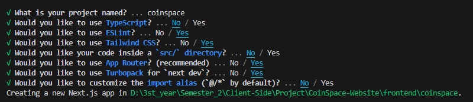

# CoinSpace-Website

โปรเจกต์ CoinSpace-Website โปรเจกต์รายวิชาการพัฒนาเว็บฝั่งไคลเอนต์ 06016429 CLIENT-SIDE WEB DEVELOPMENT (2/2024) <br> <br> ใช้ NextJS ในการพัฒนาส่วน frontend และ ... สำหรับส่วน backend โดยมีการเชื่อมต่อกับ CoinGecko API เพื่อนำข้อมูลเหรียญดิจิตอลต่างๆ มาแสดงผลในเว็บไซต์ เพื่อให้ผู้ใช้งานสามารถติดตามข้อมูลราคาของเหรียญต่างๆ


## การตั้งค่าโปรเจกต์
ตรวจสอบให้แน่ใจว่าได้ติดตั้งซอฟต์แวร์ต่อไปนี้ก่อนเริ่มโปรเจกต์:

- [Node.js](https://nodejs.org/en) (สำหรับ NextJS)  

### ลง Next.js สำหรับ Frontend
```bash
npx create-next-app@latest
```


